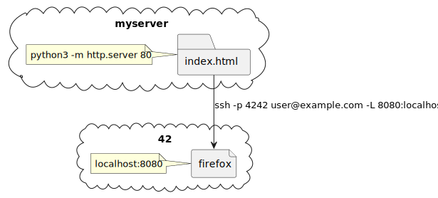

= Module 04
:toc:

== Subject

* 42: https://cdn.intra.42.fr/pdf/pdf/52163/fr.subject.pdf[Subject.fr]

== Resource

* EPFL: https://youtu.be/JfsD6AnP2Rs[Classes abstraites]

== Exercice

=== 00

image::assets/00.svg[main]

== preview

