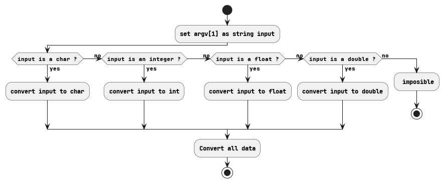

= Module 06
:toc:

== Subject

* 42: https://cdn.intra.42.fr/pdf/pdf/52154/fr.subject.pdf[Subject.fr]

== Exercice 00

Differents inputs for a boolean value:

* Literals
** true
** false
* Numeric
** 1
** 0

____
* Microsoft: https://learn.microsoft.com/en-us/cpp/cpp/numeric-boolean-and-pointer-literals-cpp?view=msvc-170[Numeric, boolean, and pointer literals]
____
